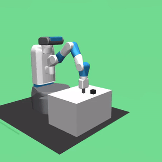

# RL for Robot Control — FetchPush with Hindsight Experience Replay

A from-scratch implementation of **Hindsight Experience Replay (HER)** applied to a simulated
7-DOF Fetch robot arm learning to push a cube to a target location. The task is a classic
example of **goal-conditioned RL with a sparse reward** — one that's effectively unsolvable
with vanilla off-policy RL, and a good testbed for understanding why HER works, how reward
shaping interacts with goal relabeling, and how SAC and DDPG differ in practice.

<table>
<tr>
<td align="center"><b>Without HER (random baseline)</b></td>
<td align="center"><b>With SAC + HER (trained policy)</b></td>
</tr>
<tr>
<td align="center"></td>
<td align="center"></td>
</tr>
<tr>
<td align="center">6% success rate (measured)</td>
<td align="center">95–99% success rate (measured)</td>
</tr>
</table>

## What's in here

- A custom Gymnasium wrapper (`scripts/fetch_push_env.py`) around `FetchPush-v4` that
  flattens the observation, exposes several reward functions, and supports domain
  randomization of object mass/friction/size.
- A **from-scratch HER replay buffer** (`scripts/her_replay_buffer.py`) implementing the
  "future" goal-relabeling strategy from Andrychowicz et al., 2017.
- Single-file **SAC** and **DDPG** training scripts (`scripts/sac_fetchpush.py`,
  `scripts/ddpg_fetchpush.py`), adapted from [CleanRL](https://docs.cleanrl.dev/), with HER
  and domain-randomization integration.
- An evaluation pipeline (`scripts/evaluate_policy.py`) that loads a trained checkpoint,
  runs evaluation episodes, and emits a standardized results JSON.

**For a detailed, diagrammed walkthrough of the methodology and the end-to-end pipeline,
see [`docs/`](docs/README.md).** The docs cover the sparse-reward problem, exactly how HER
relabeling works in this codebase, the SAC/DDPG architectures and hyperparameters, the
reward functions and their HER-compatibility constraints, domain randomization, the
evaluation pipeline, and the [overall architecture](docs/architecture.md) — with diagrams for
each.

## Why HER

**FetchPush** is goal-conditioned: every episode has a different target position, and the
natural reward is sparse (0 if the object is within 5cm of the goal, -1 otherwise). With
random exploration, a 7-DOF arm reaches the goal by chance only ~5% of the time, so a
standard replay buffer almost never contains a positive learning signal.

HER's insight: **a failed attempt is a successful attempt at a different goal.** After an
episode fails to reach its intended goal, HER retroactively relabels transitions with a goal
the agent *did* achieve (a future object position from the same episode) and recomputes the
reward accordingly. This turns most failed episodes into useful training data, without
changing the environment or the algorithm's core update rule — it only changes what the
replay buffer returns.

## Results

Full experiment matrix, all trained for 250K timesteps (500K for the domain-randomization
run) on this repo's exact scripts/hyperparameters, evaluated over 100 episodes (50 for the
robustness grid) via `scripts/evaluate_policy.py`. Raw JSON for every row is in `results/`.

### All runs at a glance

Every trained checkpoint, evaluated and recorded — 10 sample episodes per run in the linked
video folder.

| Run | Algorithm | Reward type | HER | Success rate | Video (10 episodes, 20s) |
|---|---|---|---|---|---|
| `sac-baseline-no-her` | SAC | sparse | No | 6% | [`videos_baseline/sac_baseline_no_her.mp4`](videos_baseline/sac_baseline_no_her.mp4) |
| `sac-her-sparse` | SAC | sparse | Yes | **95–99%** | [`videos_sac_her/sac_her_sparse.mp4`](videos_sac_her/sac_her_sparse.mp4) |
| `ddpg-her-sparse` | DDPG | sparse | Yes | 6% | [`videos_ddpg_her/ddpg_her_sparse.mp4`](videos_ddpg_her/ddpg_her_sparse.mp4) |
| `sac-her-dense-basic` | SAC | dense_basic | Yes | 6% | [`videos_dense_basic/sac_her_dense_basic.mp4`](videos_dense_basic/sac_her_dense_basic.mp4) |
| `sac-her-progress-bonus` | SAC | progress_bonus | Yes | 67–77% | [`videos_progress_bonus/sac_her_progress_bonus.mp4`](videos_progress_bonus/sac_her_progress_bonus.mp4) |
| `sac-her-energy-efficient` | SAC | energy_efficient | Yes | 6% | [`videos_energy_efficient/sac_her_energy_efficient.mp4`](videos_energy_efficient/sac_her_energy_efficient.mp4) |
| `sac-her-dr` | SAC | sparse (+ domain randomization) | Yes | ~93–94% under randomization; 100% at nominal eval | [`videos_dr/sac_her_dr.mp4`](videos_dr/sac_her_dr.mp4) |

Each linked file concatenates that run's 10 sample episodes into one clip; the individual
per-episode files are still in each folder alongside it. Runs marked 6% never learned at all
(training curve flat from step 0) — watching their videos looks the same as the random
baseline, since that's effectively what they are. The sections below explain each comparison
and why.

### Algorithm × HER

| Configuration | Success rate | Mean return |
|---|---|---|
| SAC, no HER | 6% | -47.0 |
| **SAC + HER** | **95–99%** | ≈ -12 to -14 |
| DDPG + HER | 6% | -47.0 |

The no-HER baseline demonstrates the sparse-reward problem this whole project is built
around: random exploration reaches the goal by chance only ~6% of the time, giving a standard
replay buffer almost no positive signal to learn from. HER turns that around dramatically —
same algorithm, same network, the only change is what `rb.sample()` returns.

DDPG + HER's result is a real, investigated finding, not a leftover bug: its training curve
is flat at random-baseline level for the *entire* 250K steps, with `mean_energy` pinned at
exactly 3.0 (three action dimensions all saturated at ±1 — a collapsed, degenerate policy).
This matches a known DDPG failure mode — no twin critics, no entropy regularization, prone to
converging early on an inaccurate Q-function and never escaping — that SAC's design
specifically guards against. See [docs/04-algorithms.md](docs/04-algorithms.md#sac-vs-ddpg--summary)
for the full explanation.

### Reward engineering (SAC + HER)

| Reward type | Success rate |
|---|---|
| **sparse** | **95–99%** |
| `dense_basic` | 6% (flat the entire run — never learned) |
| `progress_bonus` | 67% |
| `energy_efficient` | 6% (flat the entire run — never learned) |

Sparse wins outright. `dense_basic` and `energy_efficient` share the same failure signature
as DDPG above — a flat training curve from step 0 — but for a different reason: neither has a
discontinuity at the success boundary the way `sparse`'s `0`-if-success-else-`-1` does, so
HER's relabeling has nothing sharp to reinforce. This reproduces a result from the original
HER paper itself: naive reward shaping can *underperform* sparse+HER on manipulation tasks.
`progress_bonus` (which adds an explicit success bonus on top of a shaping term) partially
recovers, reaching 67% — better than pure shaping, still well short of sparse. See
[docs/03-reward-engineering.md](docs/03-reward-engineering.md) for the reward formulas.

### Domain randomization & robustness

SAC + HER trained for 500K steps with object mass ∈ [0.5×, 2.0×], friction ∈ [0.5×, 2.0×],
and size ∈ [0.8×, 1.2×] all randomized every episode reset converged to **~93–94% success**
under continuously shifting physics — despite never seeing the same physical setup twice.

Robustness grid — the DR-trained checkpoint vs. the nominal-trained one, each evaluated at a
*fixed* physics shift away from nominal (50 episodes per cell):

| Mass multiplier | Nominal-trained | DR-trained |
|---|---|---|
| 0.5× | 96% | 86% |
| 1.0× | 100% | 100% |
| 1.5× | 96% | 100% |
| 2.0× | 96% | 98% |

| Friction multiplier | Nominal-trained | DR-trained |
|---|---|---|
| 0.5× | 94% | 100% |
| 1.0× | 94% | 96% |
| 1.5× | 100% | 100% |
| 2.0× | 94% | 98% |

**Honest reading, not the textbook one**: the expected "nominal-trained falls off a cliff away
from 1.0×, DR-trained degrades gracefully" pattern doesn't clearly show up here — both models
stay in the 86–100% band across the full tested range. Most plausible explanation: quasi-static
pushing is fairly forgiving of moderate mass/friction shifts on its own, so this task doesn't
stress-test domain randomization as hard as, say, dynamic/contact-rich manipulation would. With
only 50 episodes per cell, gaps under ~10 points (e.g. 96% vs. 86% at 0.5× mass) are within
noise, not necessarily a real effect. See [docs/05-domain-randomization.md](docs/05-domain-randomization.md).

## Repository layout

```
.
├── README.md                    # this file
├── docs/                        # detailed methodology + pipeline + architecture documentation
├── scripts/
│   ├── fetch_push_env.py        # env wrapper: flattening, reward functions, domain randomization
│   ├── her_replay_buffer.py     # HER replay buffer (future-strategy relabeling)
│   ├── sac_fetchpush.py         # SAC training script (CleanRL-based)
│   ├── ddpg_fetchpush.py        # DDPG training script (CleanRL-based)
│   ├── evaluate_policy.py       # loads a checkpoint, evaluates, writes results JSON
│   ├── cleanrl_utils/buffers.py # CleanRL's standard (non-HER) replay buffer
│   ├── fetch_push_env_coppeliasim.py     # experimental: same contract, CoppeliaSim-backed
│   ├── sac_fetchpush_coppeliasim.py      # experimental: SAC on CoppeliaSim
│   ├── ddpg_fetchpush_coppeliasim.py     # experimental: DDPG on CoppeliaSim
│   ├── evaluate_policy_coppeliasim.py    # experimental: evaluator for CoppeliaSim checkpoints
│   └── coppeliasim/                      # scene assets + setup helpers for the above
├── results/                     # evaluation results (JSON, one per experiment) — see README Results
├── figures/                     # plots (training curves, comparisons)
├── videos_baseline/, videos_sac_her/, videos_ddpg_her/,
│   videos_dense_basic/, videos_progress_bonus/,
│   videos_energy_efficient/, videos_dr/  # 10 sample episodes per run, one folder each — see README Results
├── assets/                      # README gifs
├── verify_custom_env.py         # quick sanity check for the custom env
└── verify_custom_env_coppeliasim.py  # sanity check + throughput probe for the CoppeliaSim variant
```

## Setup

```bash
# Create a virtual environment
python -m venv venv
source venv/bin/activate   # (Windows: venv\Scripts\activate)

# Core dependencies
pip install gymnasium[mujoco] gymnasium-robotics
pip install torch            # CPU is sufficient
pip install tyro wandb tensorboard

# CleanRL's replay buffer utility
mkdir -p cleanrl_utils && touch cleanrl_utils/__init__.py
curl -sL "https://raw.githubusercontent.com/vwxyzjn/cleanrl/master/cleanrl_utils/buffers.py" \
  -o cleanrl_utils/buffers.py

wandb login
```

Verify the custom environment:

```bash
python verify_custom_env.py
```

Expected output: a flattened `(31,)` observation and a `Box(-1, 1, (4,))` action space.

## Training

```bash
# Baseline: SAC without HER — measured 6% success (demonstrates the sparse-reward problem)
python scripts/sac_fetchpush.py \
  --reward-type sparse \
  --total-timesteps 250000 \
  --track --wandb-project-name rl-fetch-push \
  --exp-name sac-baseline-no-her --seed 42

# SAC + HER — measured 95-99% success (see Results below for the full training curve)
python scripts/sac_fetchpush.py \
  --reward-type sparse --her \
  --total-timesteps 250000 \
  --track --wandb-project-name rl-fetch-push \
  --exp-name sac-her-sparse --seed 42

# DDPG + HER — measured 6% success; see Results below, this is a real algorithmic finding
python scripts/ddpg_fetchpush.py \
  --reward-type sparse --her \
  --total-timesteps 250000 \
  --track --wandb-project-name rl-fetch-push \
  --exp-name ddpg-her-sparse --seed 42
```

Custom reward types (`dense_basic`, `multi_component`, `progress_bonus`, `energy_efficient`)
are selected with `--reward-type`; see [`docs/03-reward-engineering.md`](docs/03-reward-engineering.md)
for their formulations and HER-compatibility notes. Domain randomization is enabled with
`--randomize --mass-range MIN MAX --friction-range MIN MAX --size-range MIN MAX`; see
[`docs/05-domain-randomization.md`](docs/05-domain-randomization.md).

## Evaluation

```bash
python scripts/evaluate_policy.py \
  --model-path runs/<run-name>/sac_fetchpush.cleanrl_model \
  --env-id FetchPushFlat-v0 \
  --reward-type sparse \
  --algorithm SAC \
  --n-episodes 100 \
  --output results/sac_her_results.json \
  --record-video --video-dir videos/
```

This produces a JSON with success rate, mean return, episode length, and mean action energy —
see [`docs/06-evaluation.md`](docs/06-evaluation.md) for the full schema and metric definitions.

## Alternative simulators (explored, not completed)

Three attempts were made at running this task on the real Fetch robot's URDF instead of
Gymnasium-Robotics' built-in model, or on a different physics engine entirely — CoppeliaSim,
MuJoCo loaded directly from the raw URDF, and PyBullet. **None reached a working, trainable
state**; none of them touched any file in the pipeline above. The common thread: driving a
real, uncalibrated URDF via Cartesian/IK control turned out to be a genuine control-engineering
problem in every engine tried, not a quick integration task — PyBullet got furthest (the only
one that never diverged or exploded) but still didn't achieve precise tracking. Full honest
account, including exactly what broke and why, in
[`docs/09-alternative-simulators.md`](docs/09-alternative-simulators.md).

## Background reading

| Topic | Resource |
|-------|----------|
| HER | [Andrychowicz et al., "Hindsight Experience Replay", NeurIPS 2017](https://arxiv.org/abs/1707.01495) |
| SAC | [Haarnoja et al., "Soft Actor-Critic", 2018](https://arxiv.org/abs/1801.01290) |
| DDPG | [Lillicrap et al., "Continuous control with deep RL", 2015](https://arxiv.org/abs/1509.02971) |
| Multi-goal RL | [Plappert et al., 2018](https://arxiv.org/abs/1802.09464) |
| Domain randomization | [Tobin et al., 2017](https://arxiv.org/abs/1703.06907) |
| CleanRL | [docs.cleanrl.dev](https://docs.cleanrl.dev/) |
| FetchPush environment | [Gymnasium-Robotics Fetch docs](https://robotics.farama.org/envs/fetch/) |
