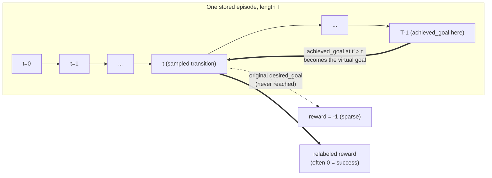
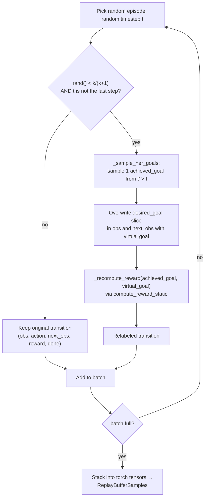

# Hindsight Experience Replay (HER)

Reference: Andrychowicz et al., *"Hindsight Experience Replay,"* NeurIPS 2017
([arXiv:1707.01495](https://arxiv.org/abs/1707.01495)).

## The core idea

> A failed attempt to reach one goal is a successful attempt at a different goal.

If the agent tried to push the cube to goal `g` and ended up at position `g'` instead, that
episode is a failure with respect to `g` — but it's a **perfect demonstration** of how to
reach `g'`. HER exploits this by taking transitions from failed episodes and relabeling them:
replace the original `desired_goal` with `g'` (a goal that was actually achieved), and
recompute the reward for that new goal. The transition itself — state, action, next state —
doesn't change; only the goal it's judged against does.

This is implemented in `scripts/her_replay_buffer.py` as `HERReplayBuffer`, a drop-in
replacement for CleanRL's `ReplayBuffer` — it returns the same `ReplayBufferSamples`
NamedTuple, so `sac_fetchpush.py` / `ddpg_fetchpush.py` don't need separate training loops
for the HER and non-HER cases.

## The "future" strategy

Of the relabeling strategies in the original paper (`final`, `future`, `episode`, `random`),
this implementation uses **`future`**, generally the strongest performer:

> For a transition at timestep `t` in an episode of length `T`, sample the virtual goal from
> the *achieved goal* at a **future** timestep `t' ∈ {t+1, ..., T-1}` of the **same episode**.



Intuition: the object's position at *any* later timestep in the episode is, by definition,
reachable from the state at timestep `t` (the agent's own trajectory proves it). Treating
that position as the goal turns an otherwise-uninformative `-1` transition into a
demonstration of successful goal-reaching — without touching the environment or collecting
any new data.

## Data structures

The buffer stores **whole episodes**, not individual transitions — relabeling needs access
to every future timestep of the same trajectory, so transitions can't be shuffled into a
flat ring buffer the way a standard replay buffer does it.

```python
# self.episodes: list of episode dicts, each shape (T, dim)
{
    "obs":      np.ndarray,  # (T, 31)
    "action":   np.ndarray,  # (T, 4)
    "next_obs": np.ndarray,  # (T, 31)
    "reward":   np.ndarray,  # (T,)
    "done":     np.ndarray,  # (T,)
}
```

`store_episode()` appends a deep-copied episode and tracks `total_transitions` across all
stored episodes. When the total exceeds `buffer_size`, whole episodes are evicted from the
front (FIFO) — oldest experience first, same eviction order as a standard ring buffer, just
at episode granularity instead of transition granularity.

Goal indices are fixed offsets into the 31-dim flattened observation (see
[Goal-Conditioned RL](01-goal-conditioned-rl.md#observation-and-action-layout)):

```python
desired_goal_start,  desired_goal_end  = 25, 28
achieved_goal_start, achieved_goal_end = 28, 31
```

## Sampling with relabeling

`sample(batch_size)` builds a batch one transition at a time:



Key details, matched to the code:

- **Relabel probability is `k/(k+1)`**, where `k = n_sampled_goal` (the paper's ratio of
  virtual to real goals). With the default `k=4`, ~80% of sampled transitions are
  HER-relabeled.
- **The last transition of an episode is never relabeled** (`t_idx < ep_len - 1` guard) —
  there's no future timestep to sample a virtual goal from.
- **`done` is never changed by relabeling.** Only the goal (and therefore the reward) is
  recomputed; the transition's terminal/non-terminal status reflects what actually happened
  in the environment, not the relabeled goal.
- **The reward is recomputed via `compute_reward_static`** (`fetch_push_env.py`), a
  `@staticmethod` that takes only `(achieved_goal, desired_goal, reward_type)` — no access
  to the live MuJoCo simulation. This is why reward functions used with HER must be
  expressible purely in terms of the two goal positions (see
  [Reward Engineering](03-reward-engineering.md)).

## Integration with the training scripts

`sac_fetchpush.py` and `ddpg_fetchpush.py` share the same integration pattern: when
`--her` is set, `HERReplayBuffer` replaces the standard `ReplayBuffer`, and transitions are
accumulated per-episode instead of being added to the buffer immediately.

```mermaid
sequenceDiagram
    participant Env
    participant Loop as Training loop
    participant EpBuf as episode_buffer (dict of lists)
    participant HER as HERReplayBuffer

    loop each env step
        Loop->>Env: step(action)
        Env-->>Loop: next_obs, reward, terminated, truncated, info
        Loop->>EpBuf: append(obs, action, next_obs, reward, done)
        alt terminated or truncated
            Loop->>HER: store_episode(stacked episode_buffer)
            Loop->>EpBuf: reset to empty lists
        end
    end
    loop each gradient step (after learning_starts)
        Loop->>HER: sample(batch_size)
        HER-->>Loop: ReplayBufferSamples (relabeled)
        Loop->>Loop: SAC/DDPG update (unchanged)
    end
```

Because `HERReplayBuffer.sample()` returns the exact same `ReplayBufferSamples` NamedTuple
CleanRL's `ReplayBuffer` does, the SAC and DDPG update steps are **completely unaware**
whether HER relabeling happened — the algorithm code is identical either way. All of HER's
effect is concentrated in what `rb.sample()` hands back.

Next: **[Reward Engineering →](03-reward-engineering.md)**
