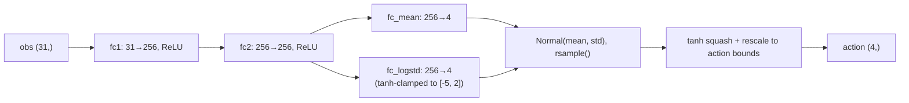
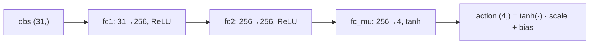

# SAC & DDPG

Both training scripts (`scripts/sac_fetchpush.py`, `scripts/ddpg_fetchpush.py`) are adapted
from [CleanRL](https://docs.cleanrl.dev/)'s single-file implementations. They're off-policy,
which is a hard requirement for HER: HER relabels *past* transitions and replays them under a
different goal, which only makes sense for an algorithm that already learns from a replay
buffer of stored experience rather than fresh on-policy rollouts (this is why PPO can't use
HER).

## Why off-policy is required for HER

An on-policy algorithm like PPO estimates a gradient using rollouts collected under the
*current* policy, discarding them after one update — it has no mechanism for revisiting a
transition later, let alone doing so under a synthetic goal it wasn't recorded with.
SAC and DDPG's core loop is: store every transition in a replay buffer, then repeatedly
sample from it to update a Q-function and a policy. HER only has to change what `rb.sample()`
returns — the rest of the algorithm is untouched (see [HER](02-her.md#integration-with-the-training-scripts)).

## SAC (Soft Actor-Critic)

**Stochastic policy, entropy-regularized, twin Q-networks.**



- **`Actor`** outputs a Gaussian `(mean, log_std)` per action dimension. Actions are drawn
  with the reparameterization trick (`rsample()`), squashed through `tanh`, and rescaled to
  the environment's action bounds — with the standard SAC correction to `log_prob` for the
  tanh squashing (`log_prob -= log(action_scale * (1 - y_t²) + ε)`).
- **Twin `SoftQNetwork`s** (`qf1`, `qf2`), each a plain 2-hidden-layer MLP over
  `concat(obs, action)`. Using the *minimum* of the two Q-estimates for the target
  (`min_qf_next_target`) reduces the overestimation bias that plagues single-critic
  actor-critic methods.
- **Entropy regularization**: the actor's loss is `(α · log_π - min_Q).mean()` — it's
  penalized for being too deterministic. `α` is auto-tuned by default (`autotune=True`)
  against a target entropy of `-dim(action_space)`, so the agent maintains enough
  exploration noise on its own without a hand-tuned temperature.
- **Delayed policy updates**: the actor and target networks update every `policy_frequency`
  (default 2) critic updates — the same delay trick TD3 introduced, to let the critic settle
  before the policy chases it.

## DDPG (Deep Deterministic Policy Gradient)

**Deterministic policy + external exploration noise, single critic.**



- **`Actor`** is a plain deterministic MLP: `tanh` output rescaled into the action bounds.
  No stochasticity comes from the network itself.
- **Single `QNetwork`** — no twin-critic overestimation correction, so DDPG's value
  estimates are more exposed to overestimation bias than SAC's.
- **Exploration is external**: Gaussian noise (`exploration_noise = 0.2`, scaled by
  `action_scale`) is added to the deterministic action at collection time, then clipped to
  the action bounds. Without this, DDPG would never explore — the policy is a fixed function
  of state.
- Both `actor`/`qf1` and their target networks are Polyak-averaged with the same `tau=0.05`
  used in SAC.

## Shared exploration mechanism

On top of each algorithm's own exploration strategy, both scripts apply the same
**epsilon-greedy layer**: before `learning_starts`, actions are fully random; after that,
with probability `random_eps` (default `0.3`) the action is still fully random rather than
policy-derived.

```python
if np.random.random() < args.random_eps:
    actions = env.action_space.sample()   # fully random
else:
    actions = <policy action, + exploration noise for DDPG>
```

This matters more than it might look: FetchPush's arm has to physically *contact* the object
before any push behavior can be learned, and `random_eps` is what guarantees the arm
regularly reaches into the space where the object lives, rather than orbiting a
locally-converged (and possibly contact-avoiding) policy. The values used here
(`gamma=0.95`, `tau=0.05`, `random_eps=0.3`, DDPG's `exploration_noise=0.2`) are tuned
specifically for HER on this task — they're more aggressive than typical SAC/DDPG defaults
(which usually use `gamma≈0.99`, `tau≈0.005`) because HER episodes are short (50 steps) and
benefit from faster bootstrapping and more exploration noise to keep finding new
`achieved_goal`s to relabel with.

## `gradient_steps`

Both scripts expose `--gradient-steps` (default `1`): the number of gradient updates run per
environment step. The original HER paper uses **40**, spread across many parallel MPI
workers collecting rollouts. Running 250K single-process env steps on a CPU with
`gradient_steps=40` would be far slower wall-clock, so the default here favors sample
efficiency of *time* over sample efficiency of *environment steps* — this is a knob worth
sweeping if you want to trade wall-clock time for fewer environment interactions.

## SAC vs DDPG — summary

| | SAC | DDPG |
|---|---|---|
| Policy | Stochastic (Gaussian → tanh squash) | Deterministic (tanh) |
| Exploration source | Entropy-regularized stochasticity + `random_eps` | External Gaussian noise + `random_eps` |
| Critics | Twin Q-networks, take the min | Single Q-network |
| Overestimation bias | Reduced (min of two critics) | More exposed |
| Entropy tuning | Automatic (`autotune`, target entropy) | N/A |
| Typical robustness | More stable across seeds | Can be brittle; more sensitive to noise scale and network capacity |
| Update cost per step | Higher (two critics + entropy coefficient) | Lower (one critic, no entropy term) |

In practice, DDPG's single point-estimate policy and critic make it more prone to exploiting
inaccuracies in the Q-function, especially early in training when the buffer contains mostly
HER-relabeled near-successes — SAC's entropy bonus and twin critics tend to make it more
forgiving of that regime. If DDPG+HER struggles to learn, the original HER paper's own DDPG
configuration used **3 hidden layers with layer normalization** rather than the 2-layer plain
MLP here — architecture depth and normalization matter more for DDPG's stability than for
SAC's.

Next: **[Domain Randomization →](05-domain-randomization.md)**
