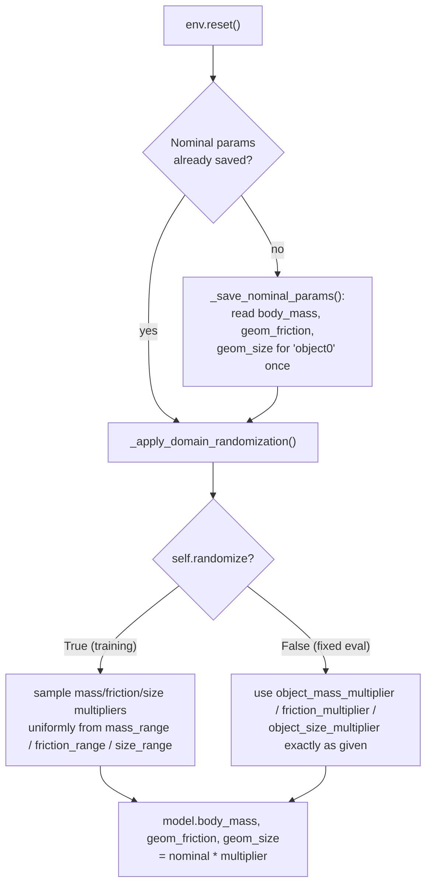

# Domain Randomization

Policies trained in simulation are fit to that simulator's exact physics. Any gap between
the simulator and reality — mass, friction, geometry — can silently break a policy that
looked perfect in training. **Domain randomization (DR)** addresses this at training time by
randomizing those physics parameters *within* the simulator, so the policy is forced to
learn a strategy that's robust to the variation rather than overfit to one exact set of
constants.

## What gets randomized

`FetchPushFlatWrapper` (`scripts/fetch_push_env.py`) can randomize three physical properties
of the pushed object, read directly from the MuJoCo model:

| Parameter | MuJoCo source | Nominal | Typical test range |
|---|---|---|---|
| Object mass | `model.body_mass[object0]` | 1.0× | 0.5×–2.0× |
| Friction | `model.geom_friction[object0]` | 1.0× | 0.5×–2.0× |
| Object size | `model.geom_size[object0]` | 1.0× | 0.8×–1.2× |

## Two distinct modes

The wrapper supports two different uses of these parameters, controlled by `randomize`:



1. **Training with `randomize=True`** — at every episode reset, each parameter's multiplier
   is drawn uniformly from a range (`mass_range`, `friction_range`, `size_range`, each
   `[min, max]`, default `[1.0, 1.0]` i.e. no randomization unless explicitly widened). This
   is how a domain-randomized policy is trained: the network never sees the same physics
   twice, so it can't overfit to one nominal configuration.

2. **Evaluation with fixed multipliers** — `object_mass_multiplier`, `friction_multiplier`,
   `object_size_multiplier` set a single, exact multiplier for the whole evaluation run
   (used by `scripts/evaluate_policy.py`'s `--object-mass-multiplier` etc.). This is how
   *robustness* is measured: train once at nominal physics (or with DR), then evaluate at a
   grid of fixed domain shifts (e.g. mass ∈ {0.5, 1.0, 1.5, 2.0}) and compare how success
   rate degrades.

These two modes share the same `_apply_domain_randomization()` code path — `randomize=True`
overrides the fixed multipliers with a fresh random draw each reset; `randomize=False` (the
default) always applies whatever fixed multiplier was passed in, which is `1.0` (nominal
physics) unless an evaluation script overrides it.

## Nominal parameters are captured once

`_save_nominal_params()` runs on the very first `reset()` and is never overwritten, so every
subsequent randomization is always relative to the environment's true baseline physics — not
relative to whatever the previous episode happened to randomize to. This prevents drift
where repeated randomization would otherwise compound (e.g. accidentally multiplying an
already-randomized mass by another multiplier).

If the MuJoCo model's body/geom names don't match (`"object0"`), parameter lookups fail
silently (caught and ignored) and the environment falls back to un-randomized nominal
physics — so a model-naming mismatch degrades gracefully rather than crashing training.

## Training a DR policy

```bash
python scripts/sac_fetchpush.py \
  --reward-type <your_best_reward> --her \
  --total-timesteps 500000 \
  --randomize \
  --mass-range 0.5 2.0 --friction-range 0.5 2.0 --size-range 0.8 1.2 \
  --track --wandb-project-name rl-fetch-push --exp-name sac-her-dr --seed 42
```

DR training typically needs more timesteps than the nominal-physics run to converge (the
policy has a harder learning problem — one physics configuration per episode instead of a
fixed one), which is why the recommended DR run doubles `total_timesteps` relative to the
nominal baseline.

## Evaluating robustness

```bash
python scripts/evaluate_policy.py \
  --model-path runs/<run-name>/sac_fetchpush.cleanrl_model \
  --algorithm SAC --reward-type <your_best_reward> \
  --object-mass-multiplier 2.0 \
  --n-episodes 50 \
  --output results/robustness_nominal_mass_2x.json
```

Run this across the mass/friction/size grid for both a nominal-trained and a DR-trained
checkpoint, then compare: the DR-trained policy should degrade more gracefully as physics
shift away from nominal, while the nominal-trained policy should perform best exactly at
1.0× and fall off faster elsewhere.

Next: **[Evaluation Pipeline →](06-evaluation.md)**
