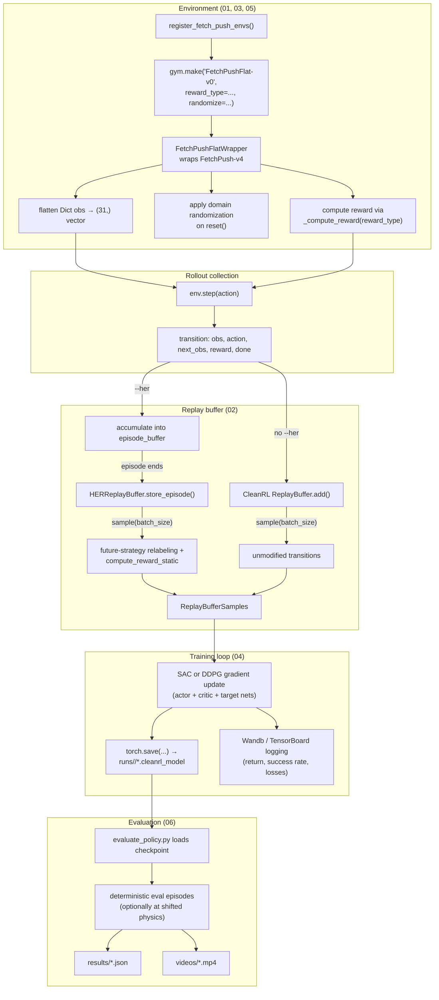

# End-to-End Pipeline

How everything in `docs/01` through `docs/06` fits together, from a fresh `gym.make()` call
to a results JSON on disk.

## Command-level walkthrough

| Step | Command | Produces |
|---|---|---|
| 1. Sanity check | `python verify_custom_env.py` | Confirms `(31,)` obs, `Box(-1,1,(4,))` action |
| 2. No-HER baseline | `sac_fetchpush.py --reward-type sparse` | ~5% success — demonstrates the sparse-reward problem ([01](01-goal-conditioned-rl.md)) |
| 3. HER baseline | `sac_fetchpush.py --reward-type sparse --her` | >50% success by ~80K steps ([02](02-her.md)) |
| 4. Reward variants | `sac_fetchpush.py --reward-type <variant> --her` | One run per custom reward ([03](03-reward-engineering.md)) |
| 5. Algorithm comparison | `ddpg_fetchpush.py --reward-type <best> --her` | SAC vs DDPG under identical conditions ([04](04-algorithms.md)) |
| 6. DR training | `sac_fetchpush.py --randomize --mass-range ... --her` | Policy robust to physics shifts ([05](05-domain-randomization.md)) |
| 7. Evaluation | `evaluate_policy.py --model-path ... --output results/*.json` | Standardized metrics + optional video ([06](06-evaluation.md)) |

## Where HER's effect actually lives

It's worth being precise about *how little* of the pipeline HER touches, because it's easy
to overestimate its footprint: HER changes exactly one thing — what `rb.sample()` returns.
Everything upstream (the environment, the reward function, action selection, episode
rollout) and everything downstream (the SAC/DDPG gradient update, checkpointing, evaluation)
is byte-for-byte identical whether `--her` is set or not. The entire mechanism is contained
in `HERReplayBuffer.sample()` swapping goals and recomputing rewards on data that's already
been collected — which is exactly why it can be dropped into an existing off-policy training
loop without touching the algorithm itself (see [HER — Integration](02-her.md#integration-with-the-training-scripts)).

## Logging and artifacts

- **Wandb / TensorBoard** (`writer.add_scalar(...)` in both training scripts): episodic
  return, episodic length, success rate, and algorithm-specific losses (`qf_loss`,
  `actor_loss`, `alpha` for SAC) logged every 100 gradient steps.
- **Checkpoints**: `runs/{run_name}/{exp_name}.cleanrl_model` — SAC saves the actor's
  `state_dict()` alone; DDPG saves `(actor.state_dict(), qf1.state_dict())` as a tuple (see
  [Evaluation](06-evaluation.md#loading-a-checkpoint) for why loading branches on algorithm).
- **Results**: one JSON per experiment in `results/`, schema defined in
  [Evaluation](06-evaluation.md#results-json-schema).
- **Videos**: recorded automatically by `--capture-video` during training or
  `--record-video` during evaluation, written to `videos/`.
