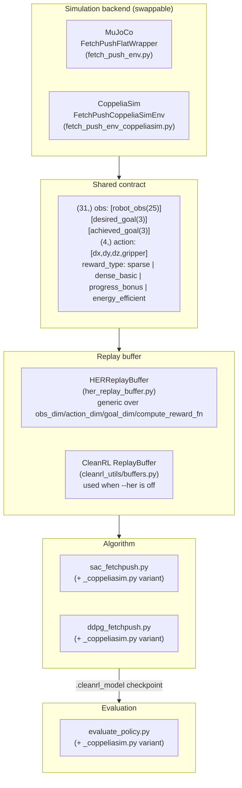

# Architecture

A structural view of the codebase — what the pieces are, what each owns, and how they
compose. For the *runtime* view (what happens on a `gym.make()` call, step by step), see
[07-pipeline.md](07-pipeline.md); this doc is the complementary *static* view: module
boundaries and why they're drawn where they are.

## Layered overview

The whole design hinges on the **shared contract** in the middle: as long as a backend
produces a `(31,)` observation in the `[robot_obs][desired_goal][achieved_goal]` layout and
accepts a `(4,)` action, everything below that line — the HER buffer, both algorithms, the
evaluator — doesn't know or care which physics engine produced it. That's what makes the
CoppeliaSim variant possible without touching a single line of the MuJoCo pipeline: it's a
second implementation of the top box, not a fork of everything beneath it.

## Module responsibilities

| Module | Owns | Does *not* own |
|---|---|---|
| `fetch_push_env.py` (`FetchPushFlatWrapper`) | Wrapping MuJoCo's `FetchPush-v4`: obs flattening, all 5 reward formulas, domain randomization via direct MuJoCo model-array writes | Any RL algorithm logic, any knowledge of HER |
| `fetch_push_env_coppeliasim.py` (`FetchPushCoppeliaSimEnv`) | The same contract, backed by CoppeliaSim's ZMQ Remote API instead of MuJoCo — observation construction from `sim.getObject*` calls, IK-target-based action application, CoppeliaSim-specific domain randomization | Reimplementing reward math it can import instead (`compute_reward_static`, `get_goal_from_obs`) |
| `her_replay_buffer.py` (`HERReplayBuffer`) | Episode storage, "future" goal relabeling, reward recomputation via an injected `compute_reward_fn` | Anything about *which* environment or algorithm is using it — fully generic, parameterized entirely through its constructor |
| `sac_fetchpush.py` / `ddpg_fetchpush.py` | The actual SAC/DDPG algorithms: networks, target updates, the training loop, episode-to-buffer bookkeeping, the `--monitor-every` live viewer | Environment internals — only imports `register_*_envs()` and passes `env_id`/`env_kwargs` through |
| `evaluate_policy.py` | Loading a `.cleanrl_model` checkpoint (branching on SAC vs. DDPG's different save format), running deterministic eval episodes, emitting the results JSON | Training — never touches a replay buffer or gradient |
| `cleanrl_utils/buffers.py` | The non-HER baseline replay buffer (vendored from CleanRL) | HER-specific logic — this is what `HERReplayBuffer` stands in for when `--her` is passed |

## Why the CoppeliaSim variant is duplicated files, not shared ones

`sac_fetchpush_coppeliasim.py` is ~95% identical to `sac_fetchpush.py` — same networks, same
training loop, same HER integration. That's a deliberate tradeoff, not an oversight: the
project constraint was "don't modify the existing MuJoCo files," so the only way to add a
second backend without touching them is to copy the training-loop code and swap the handful
of environment-specific lines (the registration import, the `env_id` default). The actual
reusable logic — `HERReplayBuffer`, `compute_reward_static`, `get_goal_from_obs` — *is*
imported, not copied, from the original files; only the algorithm-loop boilerplate is
duplicated. See [08-coppeliasim-variant.md](08-coppeliasim-variant.md) for the exact
line-by-line diff between each pair of files.

## A few design decisions worth knowing about

- **`gym.register(entry_point=SomeClass, ...)` uses the class object directly, not a string.**
  Gymnasium supports both `entry_point="module.path:ClassName"` (resolved via
  `importlib.import_module` at `gym.make()` time) and a direct callable. This codebase uses
  the callable form specifically because the training scripts are invoked as
  `python scripts/sac_fetchpush.py` (which puts `scripts/` on `sys.path[0]`, not the repo
  root), while other entry points (`verify_custom_env.py`) run from the repo root instead —
  two different `sys.path` contexts for the same registration call. A string entry point only
  resolves correctly in one of those contexts; passing the class directly sidesteps import-path
  resolution entirely and works in both.
- **`HERReplayBuffer` takes `compute_reward_fn` as a constructor argument, not an import.**
  This is what makes it reusable across backends: it never imports `FetchPushFlatWrapper` or
  anything MuJoCo-specific, so the exact same class works for the CoppeliaSim variant by
  passing a different (but interface-compatible) reward function in.
- **Episode buffers in the training scripts squeeze the `num_envs` axis before storing.**
  `envs.step()` returns vectorized shapes (`(num_envs, obs_dim)`, etc.) even when
  `num_envs=1`. `HERReplayBuffer` is documented and written against per-timestep shapes
  (`(obs_dim,)`, scalar reward/done) — storing the raw vectorized shapes instead breaks both
  the goal-relabeling indexing in `_sample_her_goals` and the reward/done assignment in
  `sample()`. Both training scripts squeeze this explicitly at the point of appending to the
  episode buffer.
- **`evaluate_policy.py` never loads `action_scale`/`action_bias` from a checkpoint.** These
  are deterministic functions of the action space bounds, not learned parameters, so the
  loader always lets a freshly-constructed network recompute them from the live environment
  rather than trusting whatever shape they happened to be saved with — this matters because a
  training script bug (fixed since) once saved them with a vectorized-env shape that a
  differently-shaped fresh network couldn't load directly.

## Results-flow note

Every entry in `results/*.json` is produced by exactly one path: a training script writes a
`.cleanrl_model` checkpoint under `runs/<run-name>/`, and `evaluate_policy.py` (or its
CoppeliaSim variant) reads that checkpoint and writes the JSON. There's no other way results
get produced — if a number is in `results/`, it traces back to a specific checkpoint file
still sitting in `runs/`. See [06-evaluation.md](06-evaluation.md) for the JSON schema and the
[root README's Results section](../README.md#results) for the consolidated numbers.
